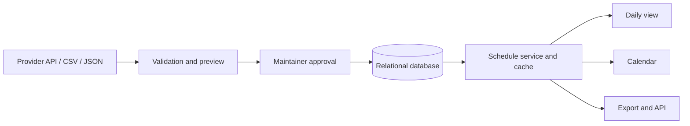

> **Canonical benchmark — reference only.** This is a sanitized, fictionalized README specimen. Its domains are reserved examples, its identities are generic, and its claims are illustrative. Never treat any content below as evidence about a target repository, never copy its values by default, and never require another README to use the same headings or length.

# Ramadan Clock

> District-aware Sehri and Iftar schedules for Bangladesh, with a public daily view and protected timetable-maintenance tools.

Ramadan Clock helps people find the schedule relevant to their district without searching through static posters or social posts. Visitors can check the current day, switch districts, browse the full Ramadan calendar, and export a district timetable. A protected administration workflow lets maintainers validate and update the underlying data.

**[Open the illustrative live app](https://ramadan-clock.example) · [Browse the calendar](https://ramadan-clock.example/calendar) · [Report an issue](https://code.example/ramadan-clock/issues)**

> The links in this benchmark use reserved example domains. In a real project README, include a live link, screenshot, package page, release, or CI badge only after verifying both its source and destination.

## Why Ramadan Clock?

Timetables distributed as images are difficult to search, filter, update, or use on a small screen. Maintainers also need a repeatable way to validate schedules for many locations without introducing duplicate records.

The application turns that information into a focused daily utility:

- See the relevant Sehri and Iftar times at a glance.
- Switch between all supported districts.
- Browse and export a complete district timetable.
- Review calculated or uploaded entries before they are stored.
- Keep schedule-changing operations behind authenticated administration routes.

## Using the application

### Check today's schedule

1. Open the home page.
2. Choose a district.
3. Review the displayed date, Sehri time, and Iftar time.
4. Export the day or full timetable when an offline copy is useful.

After Iftar, the home page can advance to the following day's schedule while keeping the passed entry available for context.

### Browse the full calendar

Open `/calendar`, choose a district, and review the available Ramadan dates. The calendar identifies the current or upcoming entry and can export the selected district's timetable.

### Maintain timetable data

Authorized maintainers sign in at `/auth/login` and then:

1. Set the active Ramadan date range.
2. Fetch calculated entries or upload a CSV or JSON file.
3. Review validation results and the import preview.
4. Confirm the write and inspect the saved schedule.

> **Warning:** Never deploy with sample credentials. Use a unique authentication secret and a strong administrator password.

## Prayer-time source and accuracy

This specimen assumes calculated times are fetched from a third-party prayer-time API using the following verified project configuration:

| Setting | Value used by the specimen |
| --- | --- |
| Country | Bangladesh |
| Timezone | `Asia/Dhaka` |
| Calculation method | An explicitly configured provider method |
| Sehri value | Fajr returned by the provider |
| Iftar value | Maghrib returned by the provider |
| Automatic adjustment | None |

> **Important:** Calculated times can differ from a local mosque or religious authority because methods and local conventions vary. Readers should follow their trusted local authority when schedules differ.

A useful discrepancy report includes the district, Gregorian date, displayed time, expected time, comparison timetable, and calculation source when known.

## How it works



The specimen stores calendar dates and 24-hour time values, enforces a unique date-and-location pair, and centralizes reads, updates, imports, formatting, and schedule-state calculation in a service boundary. Public reads may use bounded caching; external provider calls should have retry and rate-limit handling.

This level of explanation is valuable because it helps a contributor reason about provenance, approval, persistence, and presentation. It is not a demand that every target README contain a diagram.

## Local development

### Prerequisites

- A repository-verified Node.js release
- The package-manager version declared by the project
- PostgreSQL or the database actually selected by the project

### 1. Clone and install

```sh
git clone https://code.example/ramadan-clock.git
cd ramadan-clock
pnpm install
```

### 2. Configure the environment

Copy the safe template rather than opening or reusing a real secrets file:

```sh
cp .env.example .env.local
```

The specimen documents each variable by purpose, requirement, and safety property:

| Variable | Purpose |
| --- | --- |
| `DATABASE_URL` | Database connection string; required |
| `AUTH_SECRET` | Authentication signing secret; required and unique per deployment |
| `APP_URL` | Canonical application URL |
| `ADMIN_EMAIL` | Initial administrator login |
| `ADMIN_PASSWORD` | Initial administrator password; replace the template value |
| `TIMEZONE` | Schedule timezone |
| `RAMADAN_START_DATE`, `RAMADAN_END_DATE` | Optional active boundaries in `YYYY-MM-DD` form |
| `ALLOWED_ORIGINS` | Permitted production web origins |

Generate secrets with an appropriate platform tool and never commit `.env.local`.

### 3. Prepare the database

```sh
pnpm db:generate
pnpm db:push
```

For local development, the project may provide an explicit seed command:

```sh
pnpm db:seed
```

Review schema changes and use the project's migration and backup process before changing production data.

### 4. Start the application

```sh
pnpm dev
```

Open the exact local URL printed by the development server. The verified success signal in this specimen is a healthy home page that shows a date and either a schedule or a clear empty-data state.

## Schedule import format

The illustrative importer accepts JSON or CSV. Dates use `YYYY-MM-DD`; times use 24-hour `HH:mm`.

### JSON

```json
[
  {
    "date": "2030-02-05",
    "sehri": "05:12",
    "iftar": "17:56",
    "location": "Example District"
  }
]
```

### CSV

```csv
date,sehri,iftar,location
2030-02-05,05:12,17:56,Example District
```

The importer should validate file type, size, required fields, value formats, row limits, and duplicate date-and-location pairs before writing. A target README must describe only validation the repository actually implements.

## Routes and API

| Route | Purpose | Access |
| --- | --- | --- |
| `/` | Relevant daily schedule | Public |
| `/calendar` | Full available schedule | Public |
| `/auth/login` | Maintainer sign-in | Public |
| `/admin/dashboard` | Schedule overview and management | Protected |
| `/admin/import` | Validate and import schedule data | Protected |
| `/api/schedule` | Query schedule records | API policy applies |
| `/api/health` | Application and database health | Operations policy applies |

When a project has a maintained OpenAPI document or deeper usage guide, link it rather than duplicating the full reference in the root README.

## Development commands

| Command | Purpose |
| --- | --- |
| `pnpm dev` | Start the development server |
| `pnpm build` | Create a production build |
| `pnpm start` | Start the production server |
| `pnpm lint` | Run static checks |
| `pnpm typecheck` | Check types without emitting files |
| `pnpm test` | Run the automated suite |
| `pnpm db:generate` | Generate the database client |
| `pnpm db:push` | Synchronize a development schema |
| `pnpm db:seed` | Seed explicit development data |

In a real README, every row must match a current manifest script or executable interface. CI claims must match the workflow's actual commands and triggers.

## Deployment and operations

The specimen assumes a managed application host and database. A real deployment section would identify only verified requirements, such as:

- production environment variables and secret storage;
- the build and start commands;
- database migrations, backups, and rollback ownership;
- canonical URLs and allowed origins;
- health checks, logs, caching, and third-party service limits.

Never present a provider, status badge, domain, or deploy button inferred from the benchmark. Link an operations guide when safe deployment needs more detail than the root README can carry.

## Project status and limitations

This illustrative project is described as pre-release. Its README makes the practical constraints visible:

- Displayed schedules depend on records currently stored for the chosen district.
- Provider imports depend on third-party availability and calculated prayer times.
- Calculation methods and local conventions may differ from authoritative local timetables.
- Schedule-changing routes require correctly configured authentication and authorization.
- Test coverage is not the same as complete validation across dates, timezones, imports, exports, and deployments.
- Exported files reflect the data available at generation time and may become stale.

Status and limitation wording must come from the target repository. Do not copy these constraints into unrelated projects.

## Documentation

A mature specimen makes maintained paths discoverable without inventing them:

- API usage and specification
- Data-source and caching notes
- Deployment and operations guide
- [Contribution guide](CONTRIBUTING.md)
- [Security policy](SECURITY.md)
- [Support guide](SUPPORT.md)
- [Code of conduct](CODE_OF_CONDUCT.md)

Only links whose exact targets exist belong in a real README.

## Support and security

Use the project's verified support channel for reproducible bugs. Include the affected workflow, district, date, expected result, and actual result where relevant. Never post credentials, private data, database URLs, or tokens.

Report vulnerabilities through the private path defined by the project's security policy, not a public issue.

## Contributing

The specimen welcomes focused issues and pull requests and points contributors to the repository's exact prerequisites, setup, checks, review expectations, data-discrepancy process, and conduct policy.

A real project without those paths should not borrow them from this benchmark. Document the actual participation model or state its absence.

## Funding and stewardship

If repository-native metadata provides a verified funding channel, a concise section can explain what voluntary support enables. Code, documentation, testing, issue reports, and project feedback remain valid non-financial contributions.

Funding and author identities are project-specific. They must never be inherited from the skill publisher or this specimen.

## License

This specimen assumes its fictional repository contains a matching `LICENSE` file and therefore links it as the source of truth. A real README must use the target repository's actual license status. When no license file exists, say that reuse rights have not been granted instead of selecting a license automatically.

---

## Why this is the benchmark

The specimen gives several audiences a coherent path:

- a visitor can evaluate value and perform the primary workflow;
- a contributor can reproduce local activation and recognize success;
- a maintainer can understand data provenance, approval, persistence, deployment, and risk;
- every sensitive claim is paired with a limitation or source-of-truth boundary;
- support, security, contribution, stewardship, and license paths are discoverable without overwhelming the first-use path.

Match that confidence using the target project's verified evidence. Do not match the specimen mechanically.
